# DEVWKS-2612 Lab Guide
# Tetration UserApps, Augment the Platform!
Tetration allows you to use its open Big Data engine to solve your own additional uses cases, by leveraging the telemetry data collected on the Network. You can also Bring Your Own Data into the platform, to get even more meaningful insights. This workshop will demonstrate how you can easily integrate Tetration in your IT and develop your User Apps in Python to fit your own requirements.

## Mac cheatsheet
For people unfamiliar with Apple Mac, some tricks:

* Copy / Past: "cmd+c" / "cmd+v" (not ctrl!)
* Select: Hold clicking with the trackpad and move to select

## Connect to the lab environment
**This is where you start!**

1. On the opened terminal window on your Mac laptop, run the following command:  

 ```bash  
cd Documents/DEVWKS-2612/
./start.sh
```

 It will:
 * Check laptop preparation (configuration files)
 * Connect to VPN
 * Check VPN status
 * Check cluster reachability
 * Open Chrome with 3 tabs

 <details>
 <summary>Sample start Output</summary>
 <pre>
Preparing the Workstation to Run this lab

 Checking laptop preparation...
 Ok!

 Connecting to VPN, can take a few seconds...
 Done!

 Checking VPN status:
 Connected

 Testing cluster connectivity:
 Tetration cluster is reachable, ready to go

 Opening Incognito browser window for lab
 </pre>
 </details>

2. The 3 tabs are:
 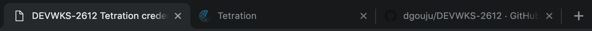
 * Your Tetration credentials
 * Tetration login banner with email already pre-filled
 * This lab guide page on GitHub
3. Log into Tetration using the password provided on the Tetration credentials tab.
4. You are now logged into Tetration with Developer role.

## Step 1: Get familiar with Jupyter notebooks
This first lab will make you do some basic operation to perceive Jupyter notebooks approach.  

1. Using left navigation pane in Tetration UI, go to Data Platform --> User Apps.  
 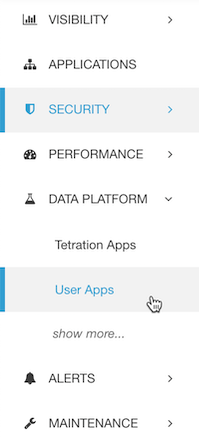  
 This is your UserApps repository, with lab apps and examples provided for your reference:
 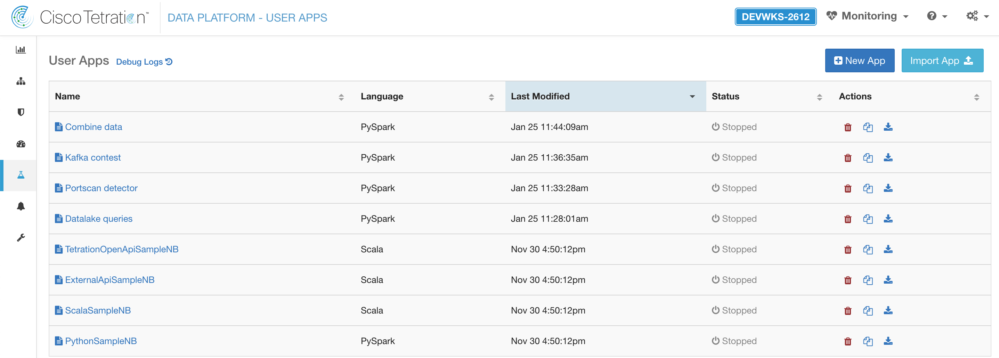 
2. Create a New App in PySpark that you can name "Jupyter basics"
3. You will enter in your newly created UserApp. Let's have a look at the toolbar and menus:  
 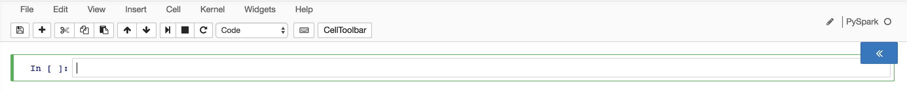  
4. Each cell is an independent block of code, with state, data... Add **two** other cells using **+** in the toolbar.
5. In the **first cell**, enter:  

 ```python
myvar = "Hi Tetration"
print(myvar)
```

6. In the **second cell**, enter:  

 ```python
myvar = "Hi Cisco Live"
```

7. In the **third and last cell**, enter:  

 ```python
print(myvar)
```

8. Then, select the **first cell** by clicking on it and run it using the "run cell, select bellow" button (looks like a play/pause button) in the toolbar.  
Notice the value between [ ] and the result.  
9. Run the **second** cell
10. Run the **third** cell  
Ok, nothing fancy for now. Now continue carefully:
11. Run the **first** cell
12. Run the **third** cell, not the second  
Did you get it? Notice the value between [ ]. You can continue if you want:
13. Run the **second** cell
14. Run the **third** cell
15. We can now save and exit:
 * Save using the toolbar "Save and Checkpoint" button.
 * Using left navigation pane in Tetration UI, go to Data Platform --> User Apps.
16. Look a the status and buttons of your app:  
 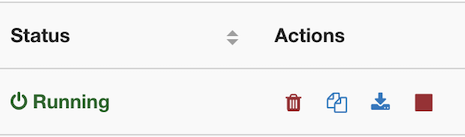  
 As you did a Checkpoint and your app is still running, you could go back into it. All states are saved, and you could continue incrementing the value between [ ].  
 Let's save some resources, so stop your application. Checkpoint will be deleted.

## Step 2: Query the datalake
### Accessing datalake

1. Open the User App named "Datalake queries"
 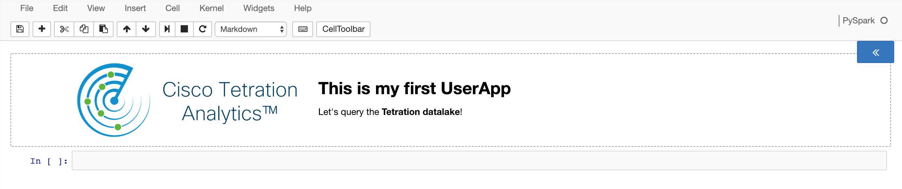
2. On the right side, unroll App Options using the blue chevron and look at usage example:  
 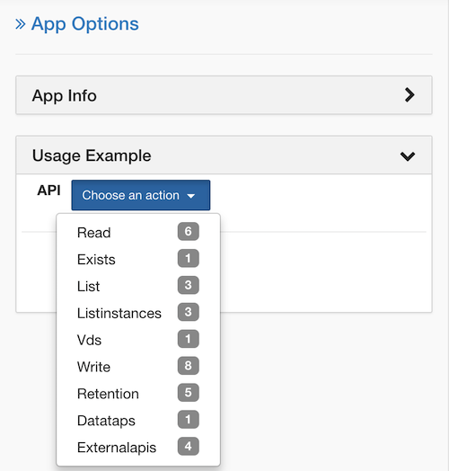  
To avoid managing a lot of Spark configuration, Tetration UserApps offers you some functions managing that for you.  
3. Click on Read to read data from the Datalake.
4. There are multiple lists of parameters you can use to query the datalake. Browse them, and stop on option 4 of 6:  
 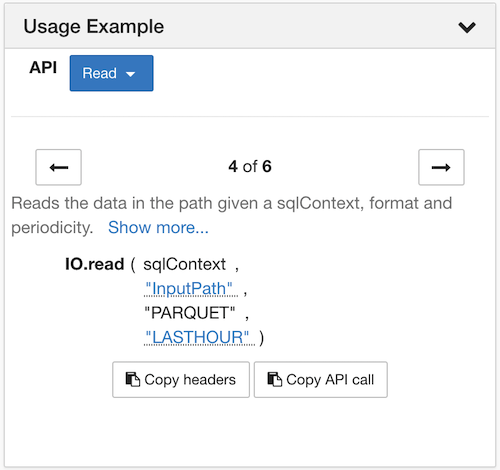  
5. Click on **InputPath** and navigate to Tetration --> Flows (**DO NOT CLICK ON A DATE**). Then click on **Dismiss** (on the very bottom).
6. Click on **Copy headers** and paste in the **last empty cell**. This code gives you access to Spark (Spark Context) in SparkSQL. Your cell should now look like this:

 ```python
from pyspark.sql import SQLContext
sqlContext = SQLContext(sc)
```

7. Click on **Copy API call** and past **in the same cell**. Hide the App Option panel with the chevrons. This code returns the Spark main object called RDD (Resilient Distributed Dataset). Add ```.registerTempTable("my_flows")``` in the end so your cell should now look like:  

 ```python
from pyspark.sql import SQLContext
sqlContext = SQLContext(sc)
sc._jvm.com.tetration.apps.IO.read(sqlContext._ssql_ctx, "/tetration/flows", "PARQUET", "LASTHOUR").registerTempTable("my_flows")
```

 This tells Spark to create a "SQL Table" (like an Excel sheet) called "my_flows" that we will manipulate in Spark SQL.

8. **Run this cell**, that contains all the structures we will then manipulate multiple times. No output is expected.
9. **Add a new cell**, put this code and run it:

 ```python
my_query = sqlContext.sql("SELECT * FROM my_flows LIMIT 2")
result = my_query.toPandas()
result
```  

 Spark collected the results and returned a Pandas object (Pandas Dataframe). Pandas is a data analysis library.
 
10. **Add a new cell** (as we got data and don't want to recollect it), and run this code in it:  

 ```python
list(result)
```  

 You have now the list of the fields available in the flows Datalake you can use!

### Use case
Let's code a portscan detector. First, we have to specify how this can be defined. We will use the following assumptions:

* Let's start with TCP (not UDP) port scan, as it can be easily extended.
* A failed connection is 1 SYN Source --> Destination packet and 0 or 1 RST Destination --> Source packet.
* We will work on source IP / destination IP / destination port tuples of failed connections.
* There should be at least X such tuples of failed connections, we will use 10 as threshold value.

This can be enhanced (looking at destination port list, ...) but let's start this way.  

1. Exit your previous UserApp by clicking on Data Platform --> User Apps in the left panel.
2. Stop your previous App "Datalake queries".
3. Open the User App named "Portscan detector"
4. There is a header to describe the UserApp. In the first code cell, the main imports are already done, Spark SQL table "flows" is created and threshold value for failed connections count is set:
  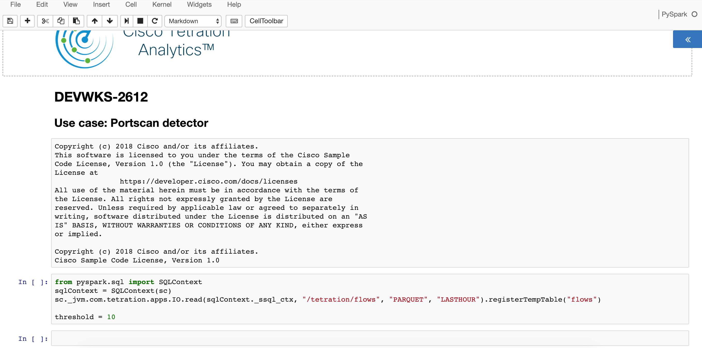

5. **Run this cell**, and **add a new cell**. We will build the correct code step by step, looking at intermediary results.
6. First, we will look for all candidates observations. This is our main data. As we will use it multiple times, we will ask Spark to cache it. Otherwise, Spark will rebuild the complete query each time and start be looking at all data in HDFS... **Put this code in the empty cell and run it**:

 ```python
# Searching for all refused connections observations
spark_port_scan_observations = sqlContext.sql("SELECT src_address AS source, dst_address AS destination, dst_port AS port, fwd_pkts, fwd_syn_count, rev_pkts, rev_rst_count FROM flows WHERE fwd_pkts = '1' AND fwd_syn_count = '1' AND (rev_pkts = '0' OR (rev_pkts = '1' AND rev_rst_count = '1'))")
spark_port_scan_observations.persist(storageLevel=StorageLevel.MEMORY_AND_DISK)
spark_port_scan_observations.toPandas()
```

 Only last line requires Spark to execute the query (returning a Pandas Dataframe).

7. Now, we need to remove (potential) duplicate entries (ex: client trying to access multiple time to the same closed / firewalled service). **Add a new cell** and paste this code and run it:

 ```python
# Removing duplicates (server trying multiple times to connect to a single port isn't a scan)
spark_port_scan_observations_cleaned = spark_port_scan_observations.dropDuplicates(['source','destination','port'])
spark_port_scan_observations_cleaned.toPandas()
```

 You noticed that `.toPandas()` is always in the end: returning data centrally is the last step, we want Spark to do all the other operations in a distributed way.

8. Then, we need to count all occurrences of same timestamp, source, destination tuple. **In the same cell**, replace the all code by this one and run it:

 ```python
# Removing duplicates (server trying multiple times to connect to a single port isn't a scan)
spark_port_scan_observations_cleaned = spark_port_scan_observations.dropDuplicates(['source','destination','port'])
# Grouping src,dst obs pairs per minute
spark_scan_tuples = spark_port_scan_observations_cleaned.groupBy(['source','destination'])
# Counting
spark_scan_tuples_count = spark_scan_tuples.count()
spark_scan_tuples_count.toPandas()
```

9. Lastly, we only keep entries if count is above threshold. **In the same cell**, replace all the code by this one and run it:

 ```python
# Removing duplicates (server trying multiple times to connect to a single port isn't a scan)
spark_port_scan_observations_cleaned = spark_port_scan_observations.dropDuplicates(['source','destination','port'])
# Grouping src,dst obs pairs per minute
spark_scan_tuples = spark_port_scan_observations_cleaned.groupBy(['source','destination'])
# Counting
spark_scan_tuples_count = spark_scan_tuples.count()
# Keeping above threshold
spark_result = spark_scan_tuples_count.filter(spark_scan_tuples_count['count'] > threshold)
# Getting results
pandas_result = spark_result.toPandas()
pandas_result
```  

 Last line requires Spark to execute the query, and it gets the data, groups and counts/filters it in a distributed way, then consolidates the result and returns it as a Pandas Dataframe.
 
 It will run for couples of seconds and then display the result.  

 **You did it!**

## Step 3: Send a message to Kafka
This a contest :-)! Kafka topic will be monitored on your proctor's screen, the messages you will post will display in order of arrival.

1. Exit your previous UserApp by clicking on Data Platform --> User Apps in the left panel.
2. Stop your previous App "Portscan detector".
3. Open the User App named "Kafka contest"
  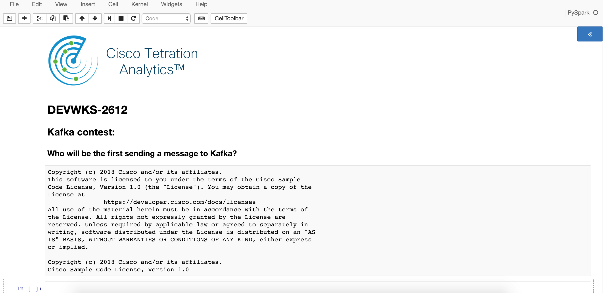
4. **In the empty cell**, create a variable called **message** and store in it a **personalized message** to identify you as the winner and run it.  

 ```python
message = "And the winner is XXXXX!"
```

5. In the next cell, put this code. It uses the API Tetration gives yo access Kafka and send a message out, and tests its return code: 

 ```python
status = sc._jvm.com.tetration.apps.DataTaps.sendMessage(message, "Alerts")
if status == 1:
	 print("Message sent")
else:
	 print("Error!")
```

6. **Run it** and look at your proctor's screen! Who will be first?

## Step 4: Combine external data with Tetration Datalake
Let's assume you have a compliance system that is able to send messages around systems that are identified as not compliant. Tetration can get this information, store it and combine it with its data.  
Your proctor sent a list of non-compliant IPs. Your mission will be to list IPs that have been accessed by these non-compliant systems.

1. Exit your previous UserApp by clicking on Data Platform --> User Apps in the left panel.
2. Stop your previous App "Kafka contest".
3. Open the User App named "Combine data"
 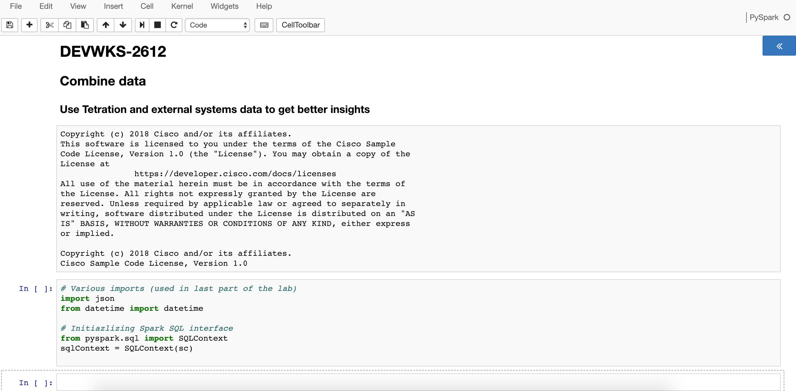
4. **Run the first cell** to initialize Spark SQL interface using your SparkContext.
5. We will now look at the latest non-compliant IPs. Tetration store its data per hour in the Datalake. So idea is to look for the latest data. **Add a new cell**.
6. In the next cell, put this code. It uses the Tetration API to get the list of hourly data sets in the Datalake coming from external systems. It takes the latest entry and displays it:

 ```python
ts = sc._jvm.com.tetration.apps.IO.list(sqlContext._ssql_ctx, "/appdata/datasink/DEVWKS-2612")[-1]
print(ts)
```

7. **Run this cell**. **Add a new one**.
8. Now we will create a Spark SQL Table on top of it and select IP list from this table. **In the new empty cell**:  

 ```python
# Create a Spark SQL table called "notcompliant" on top of latest received data (JSON)
sc._jvm.com.tetration.apps.IO.read(sqlContext._ssql_ctx, "/appdata/datasink/DEVWKS-2612", "JSON", ts).registerTempTable("notcompliant")
# Select all its content and display it
notcompliant_ips = sqlContext.sql("SELECT ip FROM notcompliant").toPandas()
notcompliant_ips
```
 Note that data format isn't PARQUET (as for Tetration Datalake) but JSON, as it is the format of the data sent by the compliance system.
 
9. **Run this cell**, you will get the data sent by the compliance system.
10. Now, we want to get suspect communications, i.e. the list of source / destination IP, destination port, protocol where source is in this list of non compliant IP. **Add a new cell** and **add in it**:

 ```python
# Create a table called "flows" with last hour data
sc._jvm.com.tetration.apps.IO.read(sqlContext._ssql_ctx, "/tetration/flows", "PARQUET", "LASTHOUR").registerTempTable("flows")
# Get required fields from this table
spark_flows = sqlContext.sql("SELECT src_address AS source, dst_address AS destination, dst_port AS port, proto AS protocol FROM flows")
# Keep only flows observations where source IP is not compliant (and drop duplicate not compliant IP if any)
spark_suspicious_flows = spark_flows.filter(spark_flows['source'].isin(notcompliant_ips['ip'].drop_duplicates().tolist()))
# Only keep unique tuples (as there may be lot of observations of same kind of flows)
spark_suspicious_tuples = spark_suspicious_flows.distinct()
# Go for it and return in a Pandas Dataframe
pandas_result = spark_suspicious_tuples.toPandas()
pandas_result
```

11. **Run this cell**.
 
 This UserApp can be scheduled as a job for ongoing analysis and result can be processed by a SIEM consuming Kafka messages, ...

## Lab Cleanup
1. Exit your current UserApp by clicking on Data Platform --> User Apps in the left panel.
2. Stop your previous App "Combine data" (and all running apps if so).
3. On the opened terminal on your Mac laptop, run the following command:  

 ```bash
cd Documents/DEVWKS-2612
source cleanup.sh
```
 <details>
 <summary>Sample cleanup Output</summary>
 <pre>
Clean up the workstation environment after the lab.
 
 Killing browsers
 
 Stopping AnyConnect
 
 Cleaning files
 
 Cleanup completed.
 </pre>
 </details>

## Conclusion
During this workshop, you manipulated key concepts of Tetration User Apps:

* Accessing Tetration Datalake, listing available data
* Processing this data in your own way
* Sending data out of Tetration using Kafka
* Combining Tetration and your data for more contextual use cases

Now you have the basic knowledge, imagine what you can do with some Python skills!

Pro-tip: this code allows you to list all the available python libraries

```python
for dist in __import__('pkg_resources').working_set:
    print(dist)
``` 